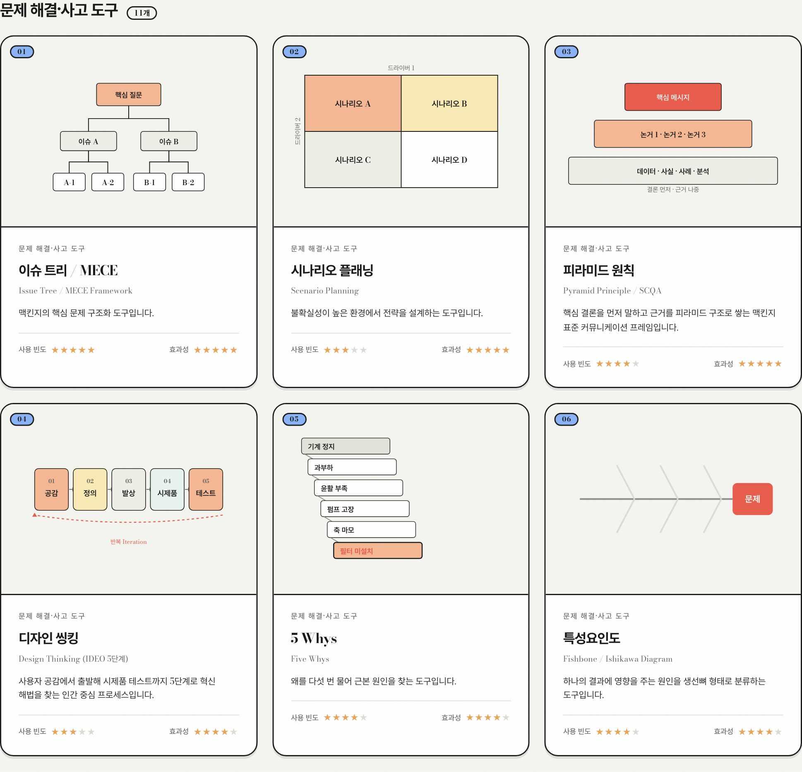
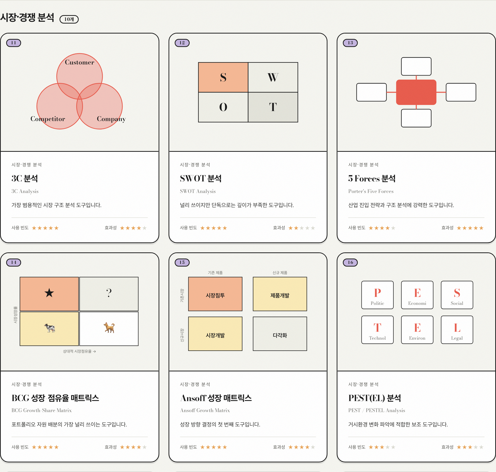
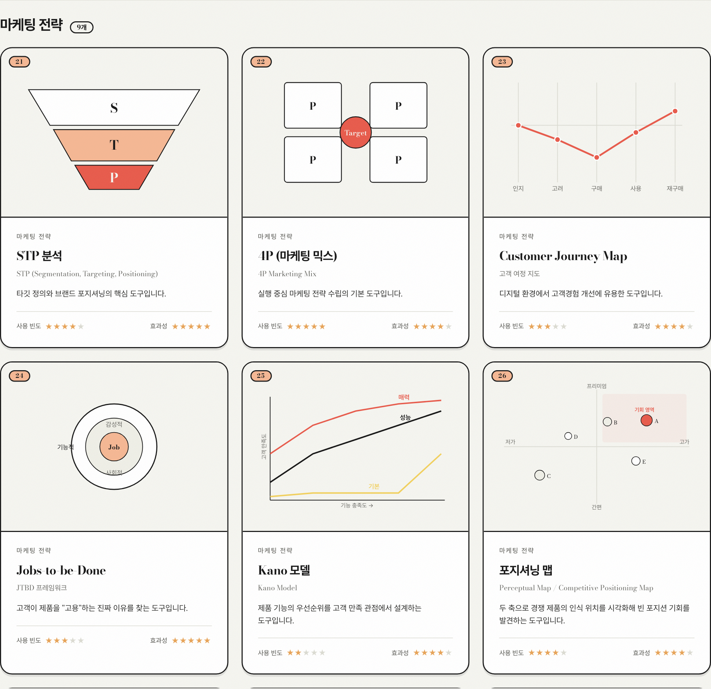
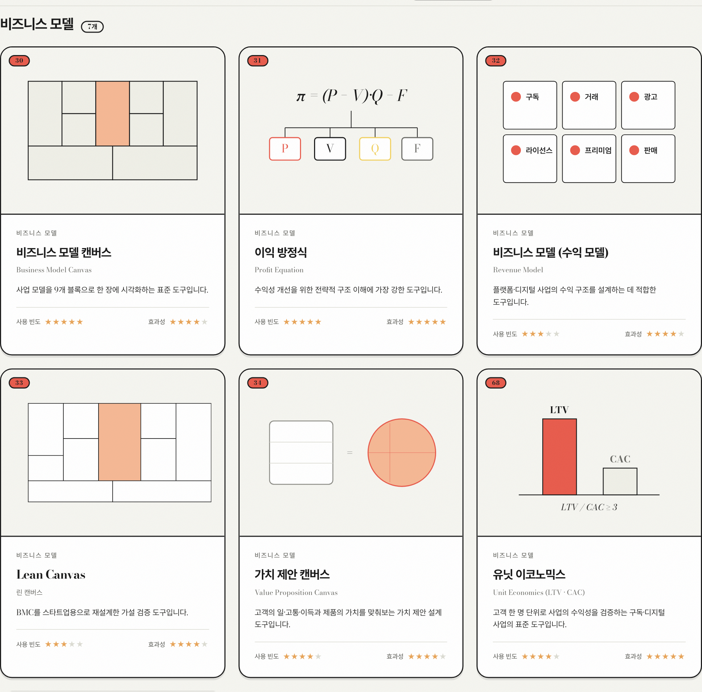
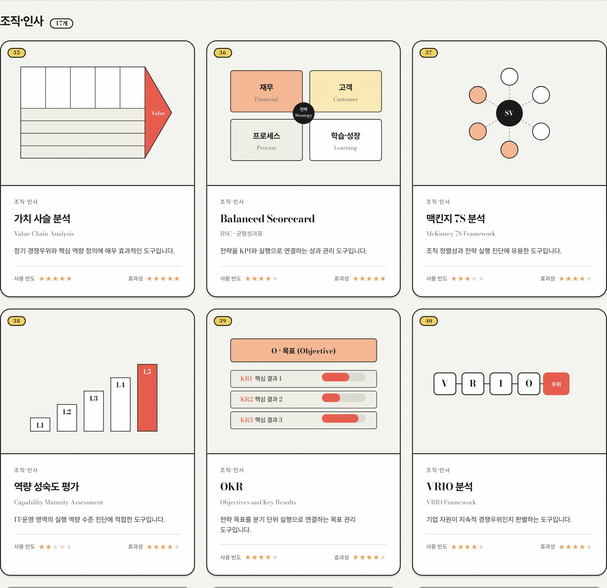
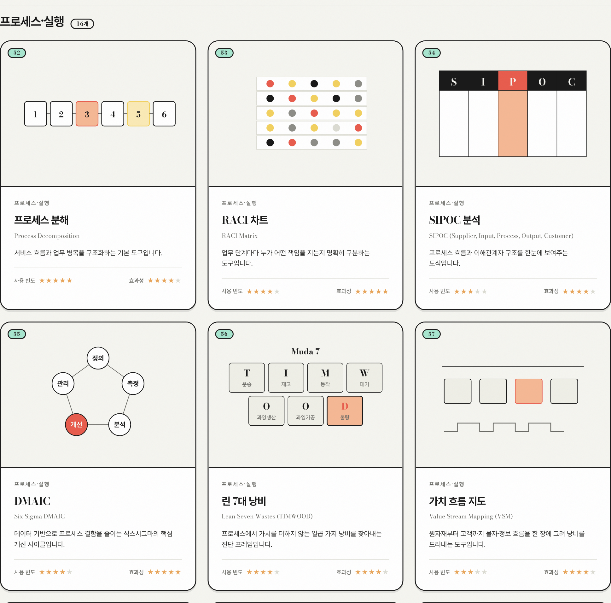

# 70개 전략 프레임워크

[](https://github.com/airoasting/strategy)
[](index.html)
[](LICENSE)

맥킨지·베인·BCG 현장 도구 70개를 한 자리에 모았습니다.
카드로 탐색하고, AI가 상황에 맞는 도구를 골라줍니다.

**[airoasting-strategy.vercel.app](https://airoasting-strategy.vercel.app/)**

---

## 배경

전략 프레임워크는 많은데, 지금 내 상황에 뭘 써야 할지 모르겠는 경우가 더 많습니다.

갤러리에서 70개를 직접 훑어보거나, AI 스킬에 상황을 말하면 맞는 도구를 골라줍니다.

---

## 시작하기

### 갤러리 로컬 실행

```bash
git clone https://github.com/airoasting/strategy.git
cd strategy
npx http-server . -p 8000
```

[http://localhost:8000](http://localhost:8000)

### AI 추천 스킬 설치

```bash
git clone https://github.com/airoasting/strategy.git
ln -s "$(pwd)/strategy/strategy" ~/.claude/skills/strategy
```

설치하고 나면 상황을 말하는 것만으로 도구 추천이 됩니다.

```
신사업 초기 시장 분석을 해야 하는데 어떤 프레임워크부터 써야 할지 모르겠어.
```

---

## 기능

| 기능 | 설명 |
|---|---|
| 70개 프레임워크 | 6개 카테고리, 도구마다 SVG 시각화 |
| 카테고리 필터 + 검색 | 실시간 필터링, 스크롤 스파이 연동 |
| 모달 상세 | 개요·구성·절차·예시·한계·관련 도구 |
| Pastel Card 디자인 | 본 배경, 파스텔 캡슐, Bodoni 디스플레이, 그레인 질감 |
| 반응형 + 모바일 | 데스크톱 3열 그리드, 모바일 단일 열·햄버거 메뉴 |
| AI 추천 스킬 | 상황 설명하면 1순위 도구 추천 |
| 제로 의존성 | 바닐라 JS, 빌드 없음 |

---

## 스크린샷

### 문제 해결·사고 도구


### 시장·경쟁 분석


### 마케팅 전략


### 비즈니스 모델


### 조직·인사


### 프로세스·실행


---

## 70개 프레임워크

<details>
<summary>전체 목록 보기</summary>

### 문제 해결·사고 도구 (11)
`#1` 이슈 트리 / MECE &nbsp; `#2` 시나리오 플래닝 &nbsp; `#3` 피라미드 원칙 &nbsp; `#4` 디자인 씽킹 &nbsp; `#5` 5 Whys &nbsp; `#6` 특성요인도 &nbsp; `#7` 파레토 분석 &nbsp; `#8` 6색 사고모자 &nbsp; `#9` 아이젠하워 매트릭스 &nbsp; `#10` 리스크 매트릭스 &nbsp; `#70` OODA 루프

### 시장·경쟁 분석 (10)
`#11` 3C 분석 &nbsp; `#12` SWOT &nbsp; `#13` 5 Forces &nbsp; `#14` BCG 매트릭스 &nbsp; `#15` Ansoff &nbsp; `#16` PESTEL &nbsp; `#17` GE-McKinsey 9Box &nbsp; `#18` 블루오션 전략 &nbsp; `#19` 3대 성장 지평 &nbsp; `#20` 포터 본원적 경쟁전략

### 마케팅 전략 (9)
`#21` STP &nbsp; `#22` 4P &nbsp; `#23` Customer Journey Map &nbsp; `#24` JTBD &nbsp; `#25` Kano 모델 &nbsp; `#26` 포지셔닝 맵 &nbsp; `#27` AARRR &nbsp; `#28` RFM &nbsp; `#29` AIDA

### 비즈니스 모델 (7)
`#30` BMC &nbsp; `#31` 이익 방정식 &nbsp; `#32` 수익 모델 &nbsp; `#33` Lean Canvas &nbsp; `#34` 가치 제안 캔버스 &nbsp; `#68` 유닛 이코노믹스 &nbsp; `#69` 밸류 스틱

### 조직·인사 (17)
`#35` 가치 사슬 &nbsp; `#36` BSC &nbsp; `#37` 맥킨지 7S &nbsp; `#38` 역량 성숙도 &nbsp; `#39` OKR &nbsp; `#40` VRIO &nbsp; `#41` 핵심역량 &nbsp; `#42` SMART 목표 &nbsp; `#43` 9박스 인재 매트릭스 &nbsp; `#44` Ulrich HR 모델 &nbsp; `#45` 역량 모델 &nbsp; `#46` Tuckman 팀 발달 &nbsp; `#47` 허즈버그 2요인 &nbsp; `#48` 커크패트릭 4단계 &nbsp; `#49` 직원 여정 지도 &nbsp; `#50` GROW 코칭 &nbsp; `#51` 매슬로 욕구단계

### 프로세스·실행 (16)
`#52` 프로세스 분해 &nbsp; `#53` RACI &nbsp; `#54` SIPOC &nbsp; `#55` DMAIC &nbsp; `#56` 린 7대 낭비 &nbsp; `#57` VSM &nbsp; `#58` PDCA &nbsp; `#59` 5S &nbsp; `#60` 칸반 &nbsp; `#61` 제약 이론(TOC) &nbsp; `#62` 코터 8단계 &nbsp; `#63` ADKAR &nbsp; `#64` 르윈 3단계 &nbsp; `#65` 간트 차트 &nbsp; `#66` 크리티컬 패스 &nbsp; `#67` 스크럼

</details>

---

## 스킬 예시

```
사용자  신사업 검토 중인데 어떤 프레임워크부터 써야 할지 모르겠어

AI      추천: 3C 분석 (#11)
        이유: 세부 분석으로 내려가기 전에 시장·고객·경쟁 전체 구도를 먼저
              잡아야 합니다. 3C로 큰 그림부터 정리하세요.

        첫 단계
        1. 자사(Company): 보유 자원과 핵심 강점 정리
        2. 고객(Customer): 타깃 세그먼트와 핵심 니즈 정의
        3. 경쟁(Competitor): 주요 플레이어와 포지셔닝 비교

        보조 도구: BMC(#30)로 사업 모델 초안, PESTEL(#16)로 거시환경 점검
```

---

## 구조

```
.
├── index.html
├── css/style.css
├── js/
│   ├── app.js
│   └── visualizations.js
├── data/frameworks.js
├── assets/
├── strategy/              # /strategy 추천 스킬
│   ├── SKILL.md
│   ├── README.md
│   └── references/
│       ├── frameworks.md
│       └── decision-tree.md
└── LICENSE
```

---

## 배포

정적 파일이라 루트 폴더 그대로 올리면 됩니다.

```bash
# Vercel
vercel --prod

# Netlify
netlify deploy --prod --dir .
```

GitHub Pages는 Settings → Pages에서 root 브랜치를 소스로 지정하면 됩니다.

---

## 기여

프레임워크 추가, 번역, 시각화 개선 모두 PR로 올려주세요.

1. Fork 후 브랜치 생성
2. `data/frameworks.js`에 프레임워크 추가
3. `js/visualizations.js`에 시각화 추가
4. PR 제출

---

## 라이선스

[MIT](LICENSE) © 2026 AI Roasting
