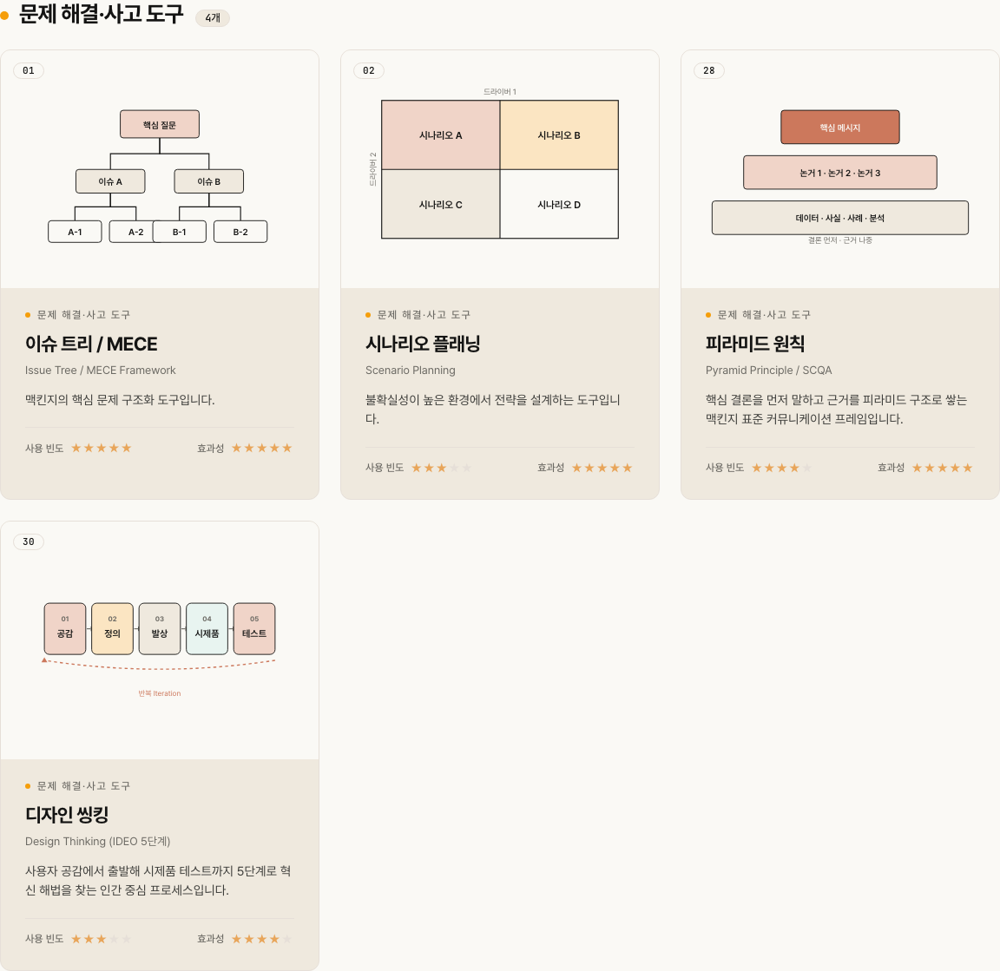
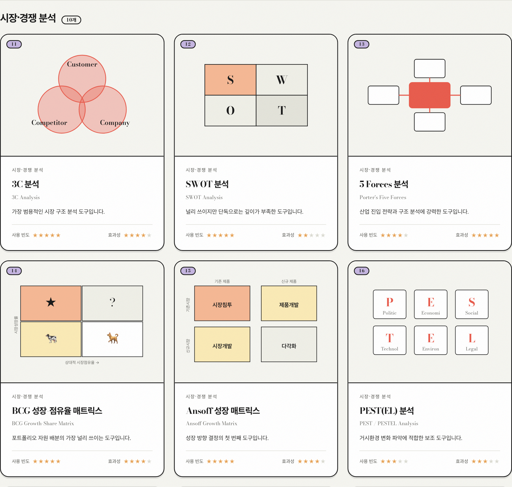
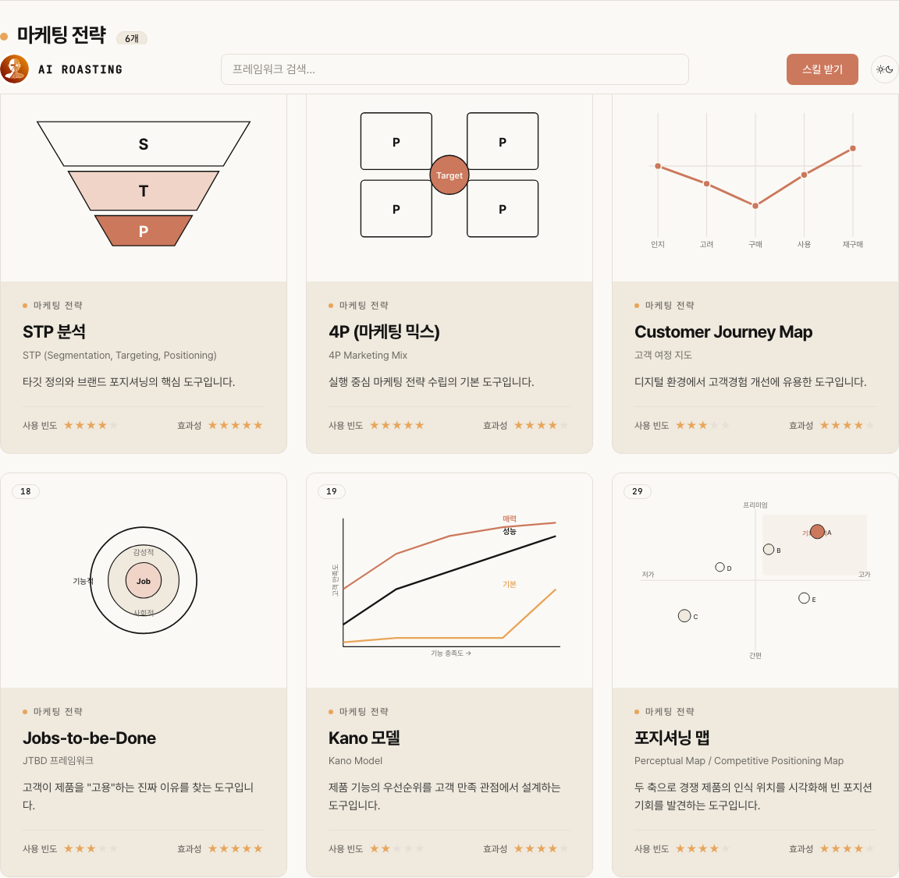
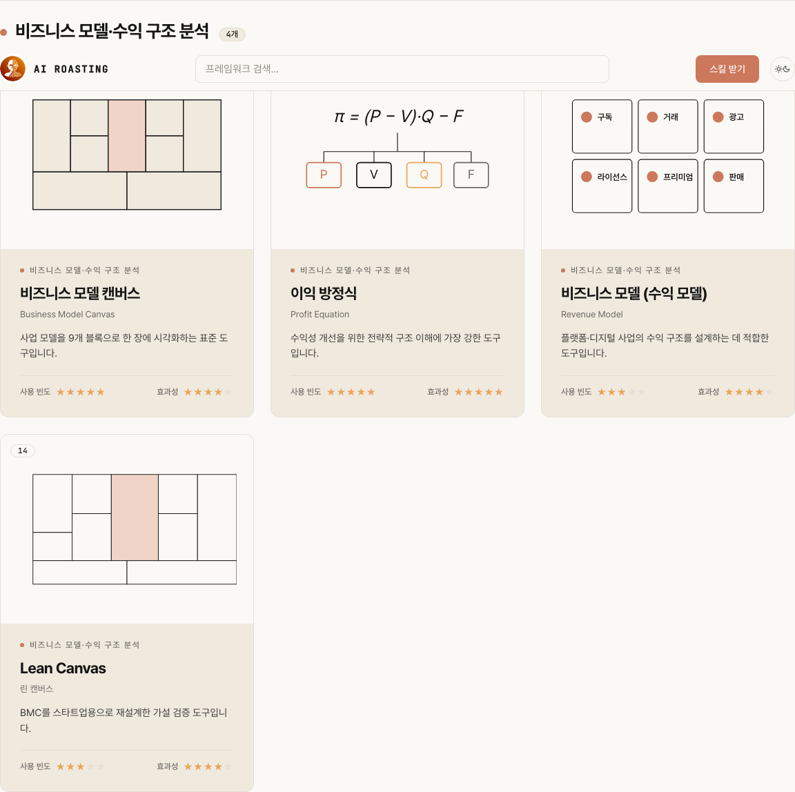
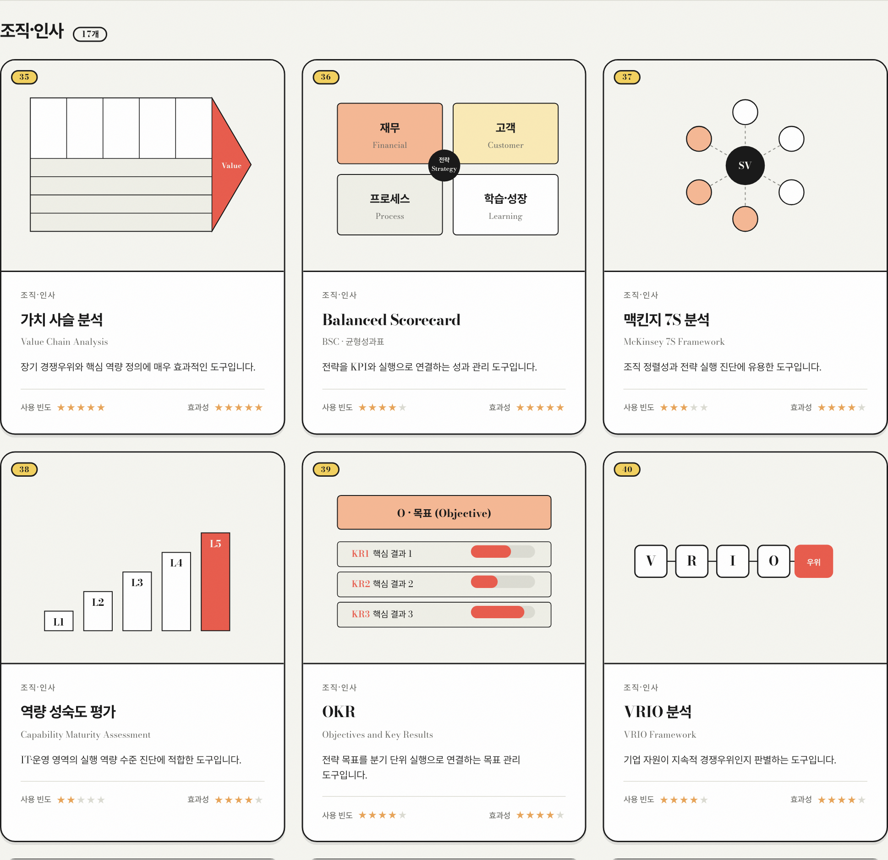
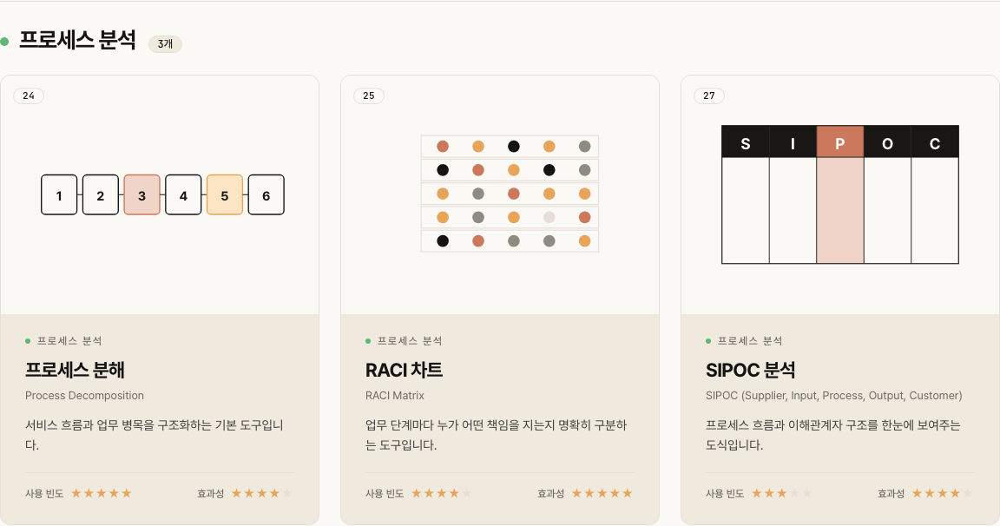

# 70개 전략 프레임워크

[](https://github.com/airoasting/strategy)
[](docs/index.html)
[](LICENSE)

맥킨지·베인·BCG 현장 도구 70개를 한 자리에 모았습니다.
카드로 탐색하고, AI가 상황에 맞는 도구를 골라줍니다.

[strategy.airoasting.com](https://strategy.airoasting.com)

---

## 배경

전략 프레임워크는 많은데, 지금 내 상황에 뭘 써야 할지 모르겠는 경우가 더 많습니다.

갤러리에서 70개를 직접 훑어보거나, AI 스킬에 상황을 말하면 맞는 도구를 골라줍니다.

---

## 시작하기

### 갤러리 로컬 실행

```bash
git clone https://github.com/airoasting/strategy.git
cd strategy
npx http-server docs -p 8000
```

[http://localhost:8000](http://localhost:8000)

### AI 추천 스킬 설치

Claude Code에서 아래 두 줄을 입력합니다.

```
/plugin marketplace add airoasting/skills
/plugin install strategy@airoasting
```

설치 후 `/strategy` 또는 "어떤 프레임워크 써야 해" 같은 표현으로 발동합니다.

### 스킬이 하는 일

비즈니스 상황을 자연어로 말하면, 70개 프레임워크 중 지금 가장 먼저 쓸 1순위 도구 하나를 골라, 앞뒤로 붙일 도구와 적용 첫 단계까지 안내합니다.

- 입력: "신사업, 시장부터 보고 싶어요", "팀 동기부여가 잘 안 돼요" 같은 한 줄 상황.
- 출력: 핵심 질문과 초기 가설, 1순위 도구와 이유, 준비물이 붙은 첫 3단계, 앞뒤 도구 순서, 한계, 차점 도구를 고르지 않은 이유, 갤러리 카드 링크.

설명이 아니라 "내 상황에 맞는 선택"이 핵심입니다. 단순 정의 검색("SWOT이 뭐야")이나 산출물(보고서·PPT) 작성은 다루지 않습니다.

`SKILL.md` 본문은 자주 쓰는 매핑만 요약하고, 전체 인벤토리와 결정 트리는 `references/`가 단일 출처입니다. 모든 `#N`은 데이터(`docs/data/frameworks.js`)·갤러리 카드 번호와 정확히 일치합니다.

---

## 기능

| 기능 | 설명 |
|---|---|
| 70개 프레임워크 | 6개 카테고리, 도구마다 SVG 시각화 |
| 카테고리 필터 + 검색 | 실시간 필터링, 스크롤 스파이 연동 |
| 모달 상세 | 개요·구성·절차·예시·한계·관련 도구 |
| Pastel Card 디자인 | 본 배경, 파스텔 캡슐, Bodoni 디스플레이, 그레인 질감 |
| 반응형 + 모바일 | 데스크톱 3열 그리드, 모바일 단일 열·햄버거 메뉴 |
| AI 추천 스킬 | 상황 설명하면 1순위 도구 추천 |
| 제로 의존성 | 바닐라 JS, 빌드 없음 |

---

## 스크린샷

### 문제 해결·사고 도구


### 시장·경쟁 분석


### 마케팅 전략


### 비즈니스 모델


### 조직·인사


### 프로세스·실행


---

## 70개 프레임워크

<details>
<summary>전체 목록 보기</summary>

### 문제 해결·사고 도구 (11)
`#1` 이슈 트리 / MECE &nbsp; `#2` 시나리오 플래닝 &nbsp; `#3` 피라미드 원칙 &nbsp; `#4` 디자인 씽킹 &nbsp; `#5` 5 Whys &nbsp; `#6` 특성요인도 &nbsp; `#7` 파레토 분석 &nbsp; `#8` 6색 사고모자 &nbsp; `#9` 아이젠하워 매트릭스 &nbsp; `#10` 리스크 매트릭스 &nbsp; `#70` OODA 루프

### 시장·경쟁 분석 (10)
`#11` 3C 분석 &nbsp; `#12` SWOT &nbsp; `#13` 5 Forces &nbsp; `#14` BCG 매트릭스 &nbsp; `#15` Ansoff &nbsp; `#16` PESTEL &nbsp; `#17` GE-McKinsey 9Box &nbsp; `#18` 블루오션 전략 &nbsp; `#19` 3대 성장 지평 &nbsp; `#20` 포터 본원적 경쟁전략

### 마케팅 전략 (9)
`#21` STP &nbsp; `#22` 4P &nbsp; `#23` Customer Journey Map &nbsp; `#24` JTBD &nbsp; `#25` Kano 모델 &nbsp; `#26` 포지셔닝 맵 &nbsp; `#27` AARRR &nbsp; `#28` RFM &nbsp; `#29` AIDA

### 비즈니스 모델 (7)
`#30` BMC &nbsp; `#31` 이익 방정식 &nbsp; `#32` 수익 모델 &nbsp; `#33` Lean Canvas &nbsp; `#34` 가치 제안 캔버스 &nbsp; `#68` 유닛 이코노믹스 &nbsp; `#69` 밸류 스틱

### 조직·인사 (17)
`#35` 가치 사슬 &nbsp; `#36` BSC &nbsp; `#37` 맥킨지 7S &nbsp; `#38` 역량 성숙도 &nbsp; `#39` OKR &nbsp; `#40` VRIO &nbsp; `#41` 핵심역량 &nbsp; `#42` SMART 목표 &nbsp; `#43` 9박스 인재 매트릭스 &nbsp; `#44` Ulrich HR 모델 &nbsp; `#45` 역량 모델 &nbsp; `#46` Tuckman 팀 발달 &nbsp; `#47` 허즈버그 2요인 &nbsp; `#48` 커크패트릭 4단계 &nbsp; `#49` 직원 여정 지도 &nbsp; `#50` GROW 코칭 &nbsp; `#51` 매슬로 욕구단계

### 프로세스·실행 (16)
`#52` 프로세스 분해 &nbsp; `#53` RACI &nbsp; `#54` SIPOC &nbsp; `#55` DMAIC &nbsp; `#56` 린 7대 낭비 &nbsp; `#57` VSM &nbsp; `#58` PDCA &nbsp; `#59` 5S &nbsp; `#60` 칸반 &nbsp; `#61` 제약 이론(TOC) &nbsp; `#62` 코터 8단계 &nbsp; `#63` ADKAR &nbsp; `#64` 르윈 3단계 &nbsp; `#65` 간트 차트 &nbsp; `#66` 크리티컬 패스 &nbsp; `#67` 스크럼

</details>

---

## 스킬 예시

```
사용자  우리 SaaS 매출은 느는데 적자가 커져. 뭘 봐야 해?

AI      추천: 유닛 이코노믹스 (#68). 매출이 늘수록 적자가 커진다면 고객 한 명을
        데려오는 비용이 그 고객이 남기는 돈보다 큰지부터 확인해야 합니다.

        핵심 질문: "매출은 느는데 적자가 커지는" 이유가 고객 획득비(CAC)에 있는가,
        고객당 남기는 돈(LTV)에 있는가?
        초기 가설: 획득비가 큰 채널(예: 유료 광고)에서 CAC가 LTV를 넘었다.

        첫 3단계 (준비물: 채널별 마케팅비·신규 고객·이탈 데이터, 1~2주, 재무와 그로스 담당)
        1. 최근 2개 분기 신규 고객을 채널별로 나눠 CAC를 계산합니다.
        2. 같은 고객군의 월 공헌이익과 이탈률로 LTV를 추정합니다.
        3. 채널별 LTV/CAC와 회수 기간을 비교해 줄일 채널을 고릅니다.

        뼈대와 순서: LTV / CAC / LTV·CAC 비율 / 회수 기간.
        AARRR(획득에서 추천까지 단계별 지표, #27) → 유닛 이코노믹스(#68)
        → 수익 모델(#32).
        채널을 정리한 뒤 과금 구조를 손볼지 판단합니다.

        주의: 초기 데이터가 적으면 LTV 추정이 크게 흔들립니다.
        이익 방정식(#31)이 아닌 이유: 회사 전체 손익보다 고객 단위 수익 구조가 먼저입니다.
        반복 구매가 없는 사업이라면 #31이 1순위가 됩니다.

        카드 보기: https://strategy.airoasting.com/#68
        원하시면 채널별 CAC 계산표를 같이 만들어 보겠습니다.
```

응답은 질문 형태에 따라 네 가지입니다. 추천형(기본), 판단형("대응해야 하나", "A안이냐 B안이냐"), 비교형("SWOT이랑 3C 중 뭐가"), 빈 입력형("도와줘", "전략")입니다. 규칙은 [`SKILL.md`](SKILL.md)에 있습니다.

---

## 구조

```
.
├── docs/                  # 웹 갤러리(배포 루트)
│   ├── index.html
│   ├── css/style.css
│   ├── js/
│   │   ├── app.js
│   │   └── visualizations.js
│   ├── data/frameworks.js
│   └── assets/logo.png
├── SKILL.md               # /strategy 추천 스킬 본문
├── .claude-plugin/plugin.json  # 마켓플레이스 설치용 매니페스트
├── references/
│   ├── decision-tree.md   # 상황 → 1순위 매핑
│   └── frameworks.md      # 70개 전수 인벤토리
├── assets/screenshots/    # README 스크린샷
├── scripts/
│   ├── build-skill-refs.js # SSOT → references/frameworks.md 생성 + 정합성 검사
│   └── capture.js          # 스크린샷 재생성
└── LICENSE
```

---

## 배포

정적 파일이라 `docs/` 폴더를 그대로 올리면 됩니다.

```bash
# Vercel
vercel --prod

# Netlify
netlify deploy --prod --dir docs
```

운영 사이트([strategy.airoasting.com](https://strategy.airoasting.com))는 Vercel이 `vercel.json`의 `outputDirectory` 설정으로 `docs/`를 배포합니다. GitHub Pages는 Settings → Pages에서 `main` 브랜치의 `/docs` 폴더를 소스로 지정하면 됩니다.

---

## 기여

프레임워크 추가, 번역, 시각화 개선 모두 PR로 올려주세요.

1. Fork 후 브랜치 생성
2. `docs/data/frameworks.js`에 프레임워크 추가
3. `docs/js/visualizations.js`에 시각화 추가
4. `references/decision-tree.md`에 추천 매핑을 넣고 `node scripts/build-skill-refs.js` 실행(frameworks.md 재생성 + 정합성 검사)
5. PR 제출

---

## 라이선스

[MIT](LICENSE) © 2026 AI Roasting
